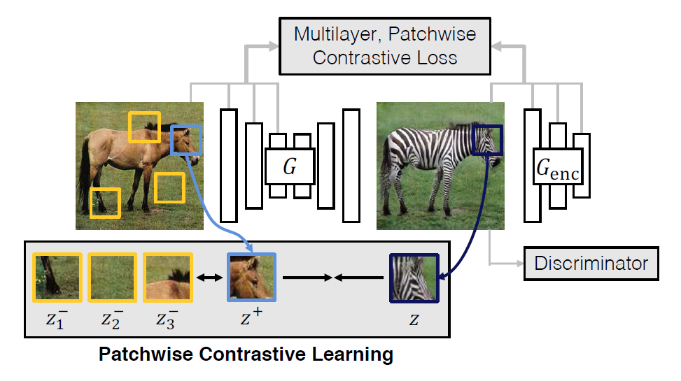
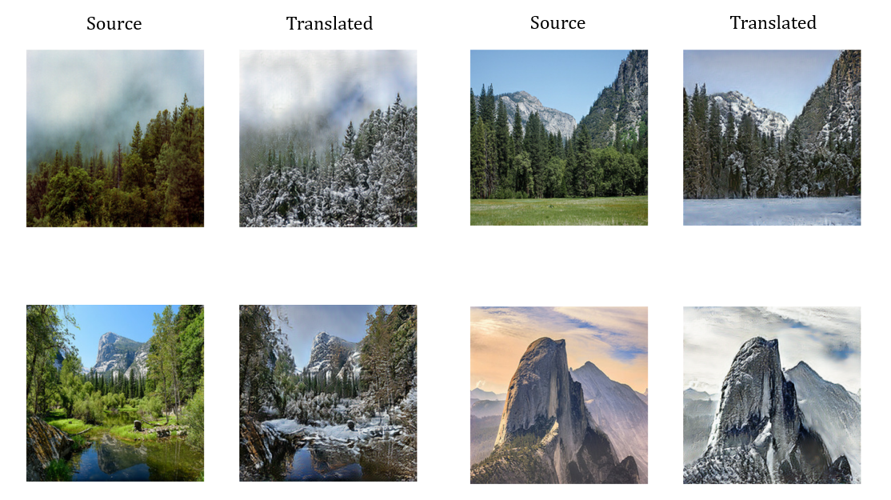
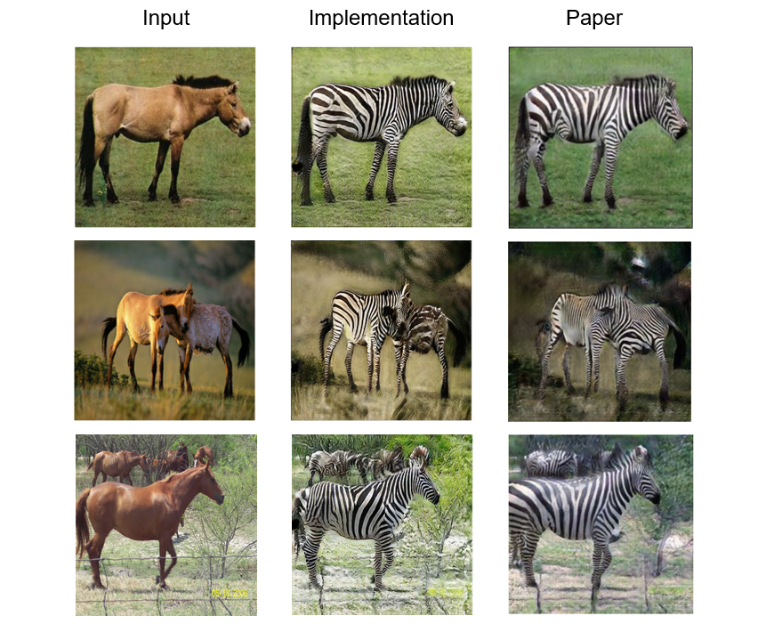

# CUT
This is an implementation of [Contrastive Learning for Unpaired Image-to-Image Translation](https://arxiv.org/abs/2007.15651) in Tensorflow 2.

Contrastive Unpaired Translation(CUT) using a framework based on contrastive learning, the goal is to associate the input and output patches, "query" refers to an output patch, positive and negatives are corresponding and noncorresponding input patches. Compared to CycleGAN, CUT enables one-sided translation, while improving quality and reducing training time.

<div align = 'center'>
  
</div>


## Translated examples of summer2winter

<div align = 'left'>
  
</div>


## Training
Use `train.py` to train a CUT/FastCUT model on given dataset.
Training takes 340ms(CUDA ops)/400ms(Tensorflow ops) for a singel step on GTX 1080ti.

Example usage for training on horse2zebra-dataset:
```
python train.py --mode cut                                    \
                --save_n_epoch 10                             \
                --train_src_dir ./datasets/horse2zebra/trainA \
                --train_tar_dir ./datasets/horse2zebra/trainB \
                --test_src_dir ./datasets/horse2zebra/testA   \
                --test_tar_dir ./datasets/horse2zebra/testB   \
```


## Inference
Use `inference.py` to translate image from source domain to target domain.
**The pre-trained weights are [located here](https://drive.google.com/drive/folders/1Y5om2S-kiSXdJKd3LHP5EDxJiNSm2djj?usp=sharing).**

Example usage:
```
python inference.py --mode cut                            \
                    --weights ./output/checkpoints        \
                    --input ./datasets/horse2zebra/testA  \
```


<div align = 'center'>
  
</div>
<p align = 'center'>
Qualitative comparisons between the implementation and the results from the paper.
</p>


## Requirements
You will need the following to run the above:
- TensorFlow >= 2.0
- Python 3, Numpy 1.18, Matplotlib 3.3.1
- If you want to use custom TensorFlow ops:
  - Please refer to the Requirements section of [stylegan2 project](https://github.com/NVlabs/stylegan2).

## Attributions/Thanks
- The code is developed based on [official-pytorch-implementation](https://github.com/taesungp/contrastive-unpaired-translation) and [Keras-CycleGAN](https://keras.io/examples/generative/cyclegan/).
- The training datasets are from [taesung_park/CycleGAN/datasets](https://people.eecs.berkeley.edu/~taesung_park/CycleGAN/datasets/).
- The cuda implementations are from [stylegan2 project](https://github.com/NVlabs/stylegan2).
